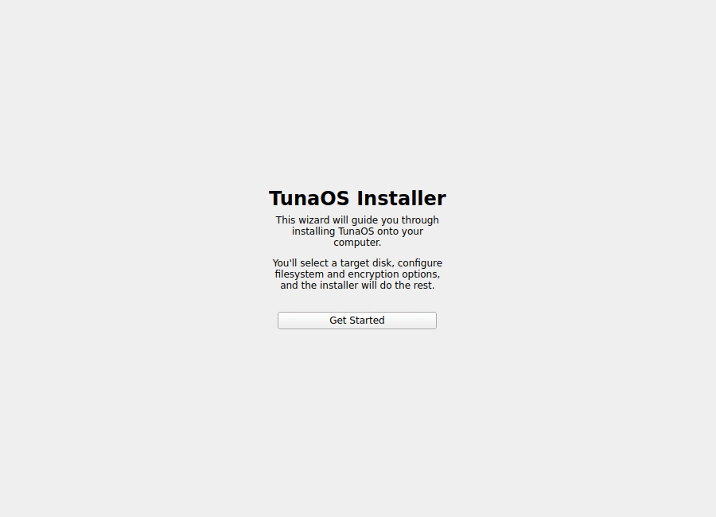

# TunaOS KDE Installer — Kirigami/Plasma 6 frontend for fisherman

<p align="center">
  
</p>

<p align="center">
  <em>Rendered in CI from the real wizard — see the <a href="docs/gui-walkthrough.md">walkthrough</a>.</em>
</p>


**Thin Qt 6 / Kirigami wizard** that drives the
[fisherman](https://github.com/tuna-os/fisherman) bootc install backend.

The UI is built the way KDE's own initial-setup wizard
([KISS](https://github.com/KDE/kiss), landing in Plasma 6.5) is built: each step
is a self-contained module at `modules/<name>/contents/ui/main.qml` whose root
is a `SetupModule` exposing `nextEnabled` and `contentItem`, driven by
`src/qml/Wizard.qml` with hand-rolled slide animations rather than a SwipeView.
Kirigami, Kirigami Addons (`FormCard`) and `Kirigami.Units` throughout — no
hardcoded pixel metrics, and no more forced Fusion style.

## Workflow

1. **Welcome** — brief intro
2. **Target Disk** — `lsblk -J` lists available disks; user picks one
3. **Disk Encryption** — none / passphrase / TPM / TPM + passphrase
4. **Confirm** — summary of choices (disk, filesystem, encryption, hostname, image)
5. **Installing** — writes recipe JSON, runs `fisherman <recipe.json>`, streams output
6. **Finished** — success/failure with close button

## Build

```bash
# Dependencies (Fedora). Kirigami and Kirigami Addons are QML-only: nothing
# links against KF6, they are resolved at runtime from the QML import path.
sudo dnf install -y cmake gcc-c++ ninja-build \
    qt6-qtbase-devel qt6-qtdeclarative-devel \
    kf6-kirigami kf6-kirigami-addons kf6-qqc2-desktop-style breeze-icons

# Build
cmake -B build -DCMAKE_BUILD_TYPE=Release
cmake --build build

# Run
./build/tuna-installer-kde
```

## Running Tests

### Backend Unit Tests

Build and execute the CTest / QtTest backend suite (`tuna-installer-backend-tests`):

```bash
cmake -B build -DCMAKE_BUILD_TYPE=Debug -DBUILD_TESTING=ON
cmake --build build
ctest --test-dir build --output-on-failure
# Or run directly:
./build/tuna-installer-backend-tests
```

### Screenshot Capture Harness

Build the offscreen QML screenshot capture executable (`tuna-installer-capture`):

```bash
cmake -B build -DCMAKE_BUILD_TYPE=Release -DBUILD_CAPTURE=ON
cmake --build build
./build/tuna-installer-capture
```

## Recipe

The installer writes a JSON recipe that fisherman consumes:

```json
{
  "disk": "/dev/nvme0n1",
  "filesystem": "btrfs",
  "btrfsSubvolumes": true,
  "encryption": {"type": "luks-passphrase", "passphrase": "…"},
  "image": "ghcr.io/tuna-os/albacore:gnome",
  "additionalImageStores": ["/usr/share/tuna-installer/oci-store"],
  "distroID": "tunaos",
  "selinuxDisabled": true,
  "hostname": "tunaos"
}
```

Encryption types: `none`, `luks-passphrase`, `tpm2-luks`, `tpm2-luks-passphrase`.
On a live ISO, `image` may be omitted — bootc installs the running container
(offline, no download). See the
[installer frontend contract](https://github.com/tuna-os/tunaos/blob/main/docs/INSTALLER-FRONTENDS.md)
for the shared recipe and screen contract.

## License

GPL-3.0-only
