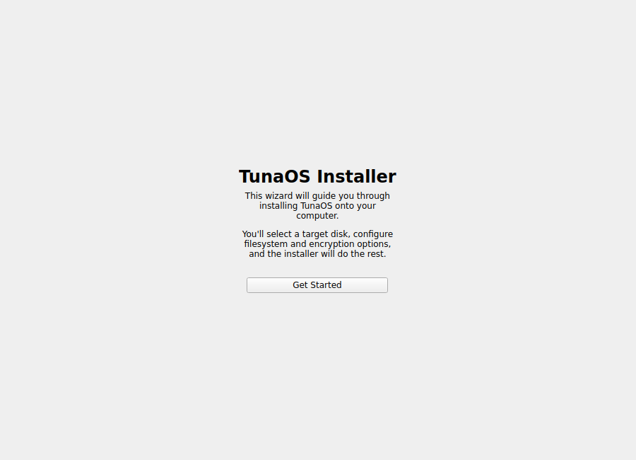
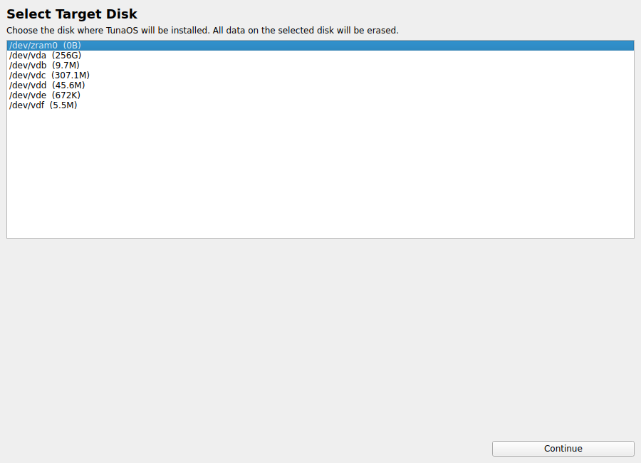
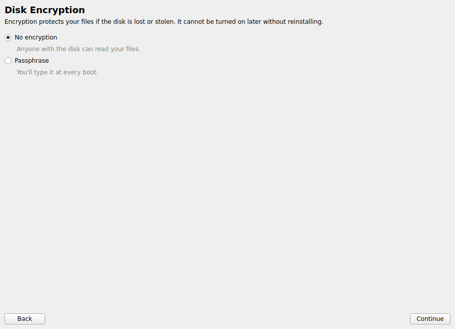
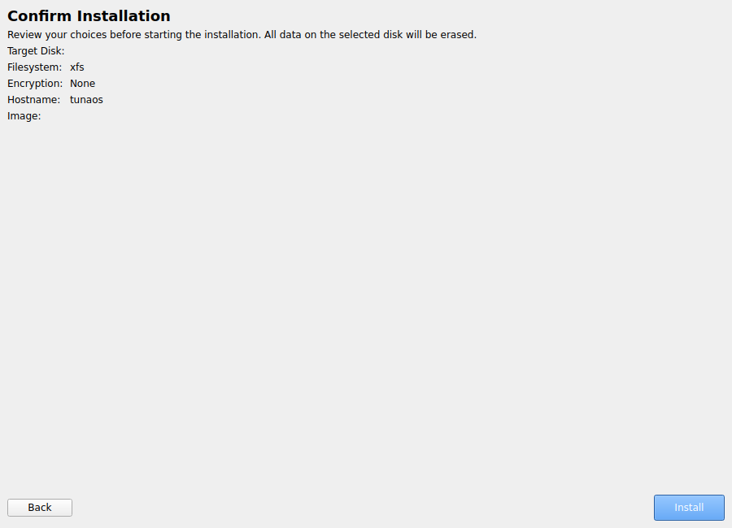
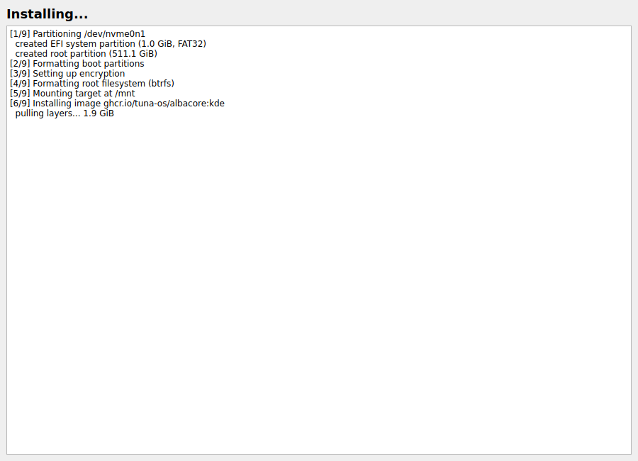
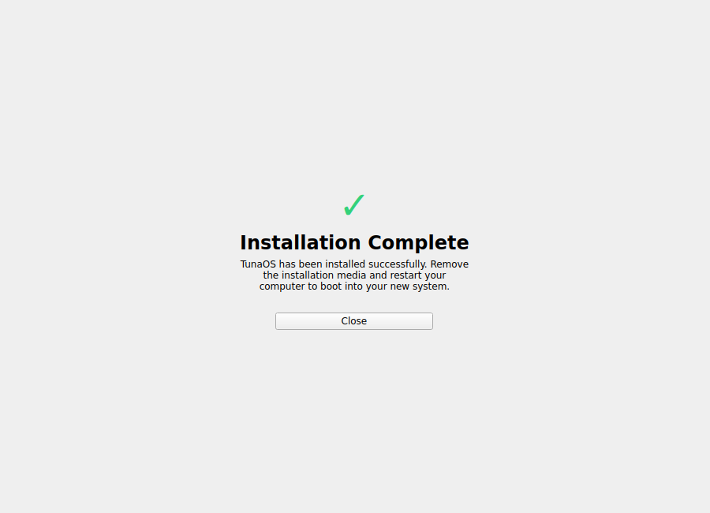

# The TunaOS KDE installer — a walkthrough

Every image here is rendered in CI from the real `Wizard` and its real pages by
`tests/capture.cpp` — only `main.cpp` is swapped — so these document the shipped
UI rather than a replica.

The capture uses Qt's **offscreen** platform plugin: no X server, no compositor
and no GPU. Qt Widgets are raster-drawn, so unlike Qt Quick there is no GL
context to arrange.

It is also safe by construction. `Wizard::navigateTo()` only switches the
stacked widget and calls the page's `prepare()`; the install is a separate
entry point (`startInstallation`) which the capture never calls. Worth stating,
because the sibling XFCE installer *does* start an install from its page-enter
hook — "drive the pages" is not automatically harmless across this family.

---

## 1. Welcome


## 2. Choose a disk


Populated from `lsblk`.

## 3. Encryption


The passphrase fields appear only for the options that need one. Options are
filtered by hardware — TPM choices are hidden where there is no TPM, which is
why this render shows two rather than four.

## 4. Confirm


The last screen before anything is written.

## 5. Installing


fisherman's output streams in as it arrives. The log shown here is fixture
data — the widget is real.

## 6. Done


---

## Regenerating these

```sh
sudo apt-get install -y cmake g++ qt6-base-dev imagemagick
cmake -S . -B build -DBUILD_CAPTURE=ON
cmake --build build --target tuna-installer-capture
./build/tuna-installer-capture docs/screenshots
```

The harness reads its own output back and fails if a screen did not really
render. That check exists because a rig which only asserts its PNGs *exist*
will happily publish blank pages: the files are present, non-empty, and the
pages are empty.
